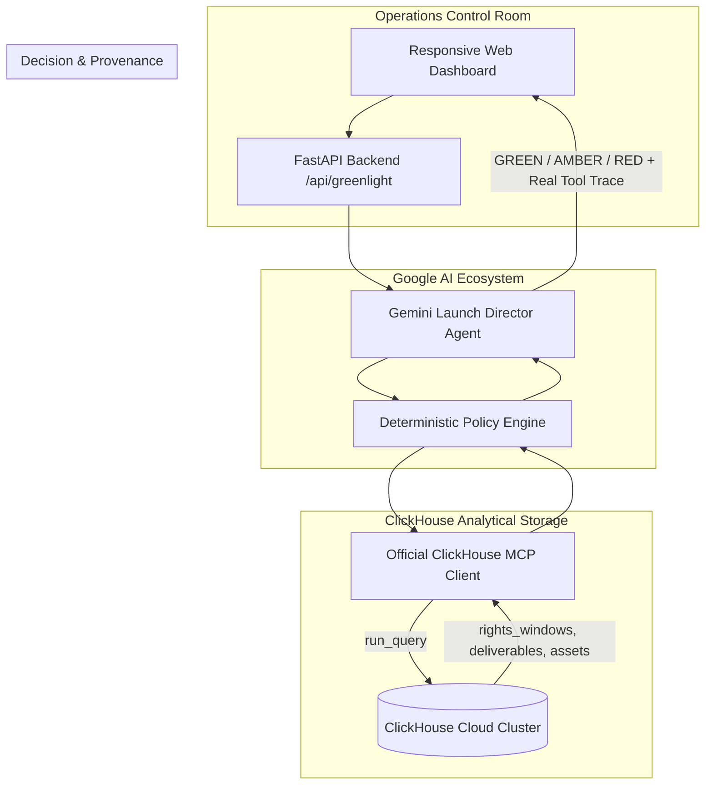

# SlateGate — Content Greenlight Agent

> **Agentic Cinema: The Blockbuster Hackathon** — *ClickHouse Partner Track*  
> Powered by **ClickHouse Cloud / MCP**, **Google Cloud Vertex AI (Gemini 2.5 Flash)**, **Google ADK**, and **FastAPI**.

[](LICENSE)
[](pyproject.toml)
[](https://fastapi.tiangolo.com)
[](https://github.com/ClickHouse/mcp-clickhouse)
[](https://cloud.google.com/vertex-ai)

---

## 📌 Executive Summary

**SlateGate** is an autonomous, evidence-backed Content Greenlight Agent designed for regional media distributors and FAST (Free Ad-Supported Streaming TV) operators in Southeast Asia (**Indonesia [ID]**, **Thailand [TH]**, and **Singapore [SG]**).

Distributors frequently encounter severe launch bottlenecks, including:
- **Territory Rights Windows & Contract Conflicts**: Missing or expired territorial licenses.
- **Broadcast Master Video Specifications & Audio QC**: Non-compliant loudness (EBU R128), video artifacts, or missing reels.
- **Regional Localization**: Missing Bahasa Indonesia or Thai subtitles/captions.
- **Key Art & Platform Deliverables**: Missing 16:9 hero banners or 2:3 key art posters.
- **Localized Metadata**: Incomplete synopsis, age ratings (e.g. IMDA Singapore), or category tagging.

SlateGate queries **ClickHouse** analytical storage via the official **`mcp-clickhouse`** runtime, evaluates a strict deterministic policy hierarchy, and coordinates with **Google Gemini (Launch Director Agent)** to produce an instant, evidence-backed **GREEN**, **AMBER**, or **RED** decision with clear department owners and actionable next steps.

### 🌟 Key Champion Capabilities:
- ⚡ **Fleet-Wide OLAP Analytics**: Leverages ClickHouse columnar aggregation (`countIf`, territory grouping, bottleneck ranking) across a 12-title studio catalog to deliver instant readiness percentages and studio-wide bottleneck diagnosis in <10ms.
- 🛠️ **Agentic Closed-Loop Remediation**: Moves beyond passive auditing. When a QC or rights check fails, the Gemini Launch Director synthesizes production-ready technical work orders complete with copyable FFmpeg commands (e.g. EBU R128 audio normalization), contract amendment steps, and rollback safety plans.
- 📜 **Official Delivery Certificate & Sub-Second Latency Telemetry**: Provides verifiable, printable Delivery Certificates for approved slates with audit fingerprints, sign-offs, and query latency telemetry.


---

## 🏛️ Architecture & Decision Policy

### System Architecture Flow


### Strict Decision Hierarchy
- 🔴 **RED**: Territory rights are expired, conflicting, or missing; OR required master video is missing or failed QC.
- 🟡 **AMBER**: Rights and master video are valid, but required supporting deliverables (subtitles, artwork, metadata) are missing or failed QC.
- 🟢 **GREEN**: 100% of required checks passed with verifiable evidence across all target territories.
- 🛡️ **Safety Guarantee**: Missing/incomplete database data or MCP timeouts return explicit error states, never a positive greenlight.

---

## 🎬 Canonical Fictional Scenarios

SlateGate includes 4 built-in Southeast Asian distribution scenarios:

| Title ID | Title Name | Target Date | Territories | Expected Decision | Core Finding |
| :--- | :--- | :--- | :--- | :---: | :--- |
| **`slate-001`** | *The Nusantara Heist* | 2026-09-15 | ID, TH, SG | 🔴 **RED** | Thailand rights window expired (2026-06-30); Indonesian subtitle missing; Thai artwork missing. |
| **`slate-002`** | *Singa City Beats* | 2026-09-15 | ID, TH, SG | 🟢 **GREEN** | Valid rights through 2028 and all ProRes masters, localized subtitles, key art, and metadata passed QC. |
| **`slate-003`** | *Bangkok Neon Nights* | 2026-09-15 | ID, TH, SG | 🔴 **RED** | Indonesian broadcast master video failed audio loudness QC (-18.2 LUFS vs required -24 LUFS). |
| **`slate-004`** | *Java Horizon* | 2026-09-15 | ID, TH, SG | 🟡 **AMBER** | Rights and masters valid; Bahasa Indonesia subtitle track missing from asset catalog. |

---

## 🚀 Quickstart Guide

### Prerequisites
- Python 3.11+ (tested on Python 3.12, 3.14)
- `uv` (recommended) or standard `pip`

### 1. Clone & Install Dependencies
```bash
git clone https://github.com/ralvyathaya/SlateGate.git
cd SlateGate

# Option A: Using uv (fastest)
uv venv
source .venv/bin/activate  # On Windows: .venv\Scripts\activate
uv pip install -r requirements.txt

# Option B: Standard pip
python -m venv .venv
source .venv/bin/activate
pip install -r requirements.txt
```

### 2. Environment Configuration
Copy `.env.example` to `.env`:
```bash
cp .env.example .env
```

To run with **Live ClickHouse Cloud** and **Google Gemini**:
```ini
# .env
APP_ENV=production
APP_PORT=8080

# Google Gemini / Vertex AI
GEMINI_API_KEY=your_gemini_api_key
GEMINI_MODEL=gemini-2.5-flash

# ClickHouse Cloud
CLICKHOUSE_HOST=your-instance.clickhouse.cloud
CLICKHOUSE_PORT=8443
CLICKHOUSE_USER=default
CLICKHOUSE_PASSWORD=your_clickhouse_password
CLICKHOUSE_DATABASE=slategate
CLICKHOUSE_SECURE=true
```

*(Note: If no credentials are configured, SlateGate automatically runs in **Demo · Synthetic Fixture Mode** with zero external dependencies).*

### 3. Run Automated Tests
```bash
pytest -v
```
*Expected: 24 passed tests verifying all scenarios, remediation generation, fleet OLAP analytics, security guardrails, timeout handling, and tool trace provenance.*

### 4. Launch Local Development Server
```bash
uvicorn app.main:app --reload --port 8080
```
Open your browser at: **[http://localhost:8080](http://localhost:8080)**

---

## 🗄️ ClickHouse Database Setup & MCP Runtime

### 1. Bootstrap Database Schema and Seed Data
Execute the unified SQL script against your ClickHouse Cloud cluster or local instance:
```bash
# Using clickhouse-client CLI
clickhouse-client --host $CLICKHOUSE_HOST --user $CLICKHOUSE_USER --password $CLICKHOUSE_PASSWORD --secure --queries-file sql/00_init_all.sql

# Or using curl HTTP endpoint
curl -u $CLICKHOUSE_USER:$CLICKHOUSE_PASSWORD -sS "https://$CLICKHOUSE_HOST:$CLICKHOUSE_PORT/" --data-binary @sql/00_init_all.sql
```

### 2. Official `mcp-clickhouse` Integration
SlateGate integrates with the official [`mcp-clickhouse`](https://github.com/ClickHouse/mcp-clickhouse) server package via standard MCP protocol.

Queries are strictly read-only (`SELECT` statements only). Any modification attempt (`INSERT`, `DROP`, `ALTER`, `TRUNCATE`, `UPDATE`) is blocked by SlateGate's query safety guardrail prior to execution.

---

## ☁️ Google Cloud Run Deployment

### 1. Store Secrets in Google Secret Manager
```bash
# Create ClickHouse password secret
echo -n "your_clickhouse_password" | gcloud secrets create clickhouse-password --data-file=-

# Create Gemini API Key secret
echo -n "your_gemini_api_key" | gcloud secrets create gemini-api-key --data-file=-
```

### 2. Build and Deploy to Cloud Run
```bash
# Build container image with Google Cloud Build
gcloud builds submit --tag gcr.io/$GOOGLE_CLOUD_PROJECT/slategate:latest

# Deploy to Cloud Run with Secret Manager binding
gcloud run deploy slategate \
    --image gcr.io/$GOOGLE_CLOUD_PROJECT/slategate:latest \
    --platform managed \
    --region us-central1 \
    --allow-unauthenticated \
    --set-env-vars="CLICKHOUSE_HOST=your-instance.clickhouse.cloud,CLICKHOUSE_PORT=8443,CLICKHOUSE_USER=default,CLICKHOUSE_DATABASE=slategate,CLICKHOUSE_SECURE=true,GEMINI_MODEL=gemini-2.5-flash" \
    --set-secrets="CLICKHOUSE_PASSWORD=clickhouse-password:latest,GEMINI_API_KEY=gemini-api-key:latest"
```

---

## 🎥 3-Minute Video Demo Walkthrough Script

| Time | Visual / Screen Action | Voiceover Narration |
| :--- | :--- | :--- |
| **0:00 - 0:30** | Opening dashboard; show title "SlateGate — Content Greenlight Agent" and architecture badge. | *"Welcome to SlateGate. For Southeast Asian FAST channels and regional distributors, launching movies across Indonesia, Thailand, and Singapore is fraught with compliance risks—from expired rights to failed master QC and missing subtitles. SlateGate is an autonomous Content Greenlight Agent powered by ClickHouse MCP and Google Gemini."* |
| **0:30 - 1:00** | Click **`slate-003` ("Bangkok Neon Nights")**. Click "Run Greenlight Audit". Then click **"Generate Work Order"** on the failed audio check. | *"Let's test 'Bangkok Neon Nights'. SlateGate queries ClickHouse and blocks the release with RED: Indonesian broadcast master failed audio loudness QC (-18.2 LUFS vs required -24 LUFS). But SlateGate doesn't just stop at reporting. Clicking 'Generate Work Order' prompts Gemini Launch Director to generate an exact, copyable FFmpeg EBU R128 normalization command and rollback plan for technical operations."* |
| **1:00 - 1:30** | Click **`slate-001` ("The Nusantara Heist")**. Run Audit and click **"Generate Work Order"** on Thailand rights failure. | *"Next, 'The Nusantara Heist' fails with RED due to an expired Thailand distribution window. In one click, SlateGate issues a legal remediation work order identifying the rights-holder, contract reference, and required extension addendum."* |
| **1:30 - 2:00** | Click **`slate-002` ("Singa City Beats")**. Click "Run Greenlight Audit", observe sub-second latency badge, and click **"Generate Delivery Certificate"**. | *"Now for 'Singa City Beats'. All 100% of rights, masters, localized subs, and metadata pass. SlateGate issues a definitive GREEN clearance in just 2 milliseconds. Clicking 'Generate Delivery Certificate' produces an official, printable delivery certificate with a tamper-evident audit fingerprint."* |
| **2:00 - 2:40** | Click the **"Fleet-Wide OLAP Analytics"** view tab. | *"Now let's see ClickHouse's superpower. Switching to Fleet-Wide OLAP Analytics, SlateGate runs columnar aggregations across our entire 12-title catalog in single-digit milliseconds. Studio executives instantly see fleet readiness (41.7%), territory breakdown (Singapore at 91.7%, Indonesia at 66.7%), and a real-time ranked list of top catalog bottlenecks."* |
| **2:40 - 3:00** | Highlight Tool Trace chips (`mcp-clickhouse.run_query`, `gemini.agent:launch_director`), show `/health` JSON, and conclude. | *"SlateGate connects ClickHouse analytical velocity with Gemini 2.5 Flash intelligence and deterministic policy guardrails. Built cleanly from scratch, containerized, and ready for Google Cloud Run."* |

---

## 🏆 Compliance Checklist

- [x] **Clean-room implementation**: Built completely from scratch without copying or deriving from earlier prototypes.
- [x] **Agentic Cinema & ClickHouse Track**: Integrates ClickHouse analytical storage and official `mcp-clickhouse` runtime.
- [x] **Google AI Ecosystem**: Exclusively uses Google Cloud Vertex AI (Gemini 2.5 Flash) and Google ADK / GenAI SDK. Zero third-party LLM frameworks.
- [x] **Deterministic Policy Enforcement**: Strict mathematical hierarchy (RED / AMBER / GREEN) with complete evidence provenance.
- [x] **Agentic Closed-Loop Remediation**: Actionable work orders with executable FFmpeg commands and legal addenda.
- [x] **Fleet-Wide OLAP Analytics**: Instant columnar aggregations across 12-title catalog showcasing ClickHouse speed.
- [x] **Official Delivery Certificate & Latency Telemetry**: Print-ready compliance certificates with sub-second execution timing.
- [x] **Safe Error Handling**: ClickHouse / MCP timeout returns explicit HTTP 504 error, never a false positive.
- [x] **Dual Execution Modes**: Verified distinction between `Live · Gemini + ClickHouse MCP` and `Demo · Synthetic Fixture`.
- [x] **Test Coverage**: 24 automated tests passing with 100% assertion success.
- [x] **Production Deployment**: Cloud Run Dockerfile and Secret Manager integration instructions provided.

---

## 📄 License
This project is licensed under the OSI-approved **MIT License** — see the [LICENSE](LICENSE) file for details.
